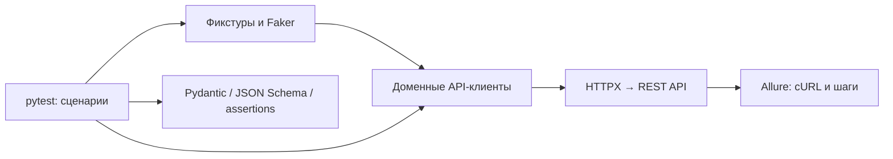

# API Test Automation · LMS

[](https://github.com/leavecoy/autotests-api/actions/workflows/test.yaml)


Портфолио QA Automation: интеграционные REST API тесты учебной платформы.
Пользователи, авторизация, курсы, упражнения и файлы — от HTTP-статуса
и структуры ответа до соответствия данных отправленному запросу.

**Стек:** Python · pytest · HTTPX · Pydantic v2 · JSON Schema · Faker · Allure · GitHub Actions.

## Что посмотреть за две минуты

1. [Упражнения](tests/exercises/test_exercises.py) — создание, чтение, обновление и удаление.
2. [Файлы](tests/files/test_files.py) — успешные запросы и ошибки валидации.
3. [Клиент курсов](clients/courses/courses_client.py) и [модели](clients/courses/courses_schema.py) — разделение HTTP-запросов и данных.
4. [Бизнес-проверки](tools/assertions/courses.py) — переиспользуемые утверждения.
5. [CI](.github/workflows/test.yaml) — отдельный сервер и ожидание готовности API.

## Сценарии

| Область | Проверки | Случаев pytest |
| --- | --- | ---: |
| Авторизация | Успешный вход | 1 |
| Пользователи | Создание с тремя email-доменами, текущий пользователь | 4 |
| Курсы | Создание, список, обновление | 3 |
| Упражнения | Создание, чтение, список, обновление, удаление | 5 |
| Файлы | Загрузка, чтение, пустые поля, отсутствующий и некорректный ID | 6 |

**19 случаев** с учётом параметризации. Это число сценариев, а не процент покрытия.
Swagger Coverage измеряет покрытие вызовов API, а не исходного кода сервера.

## Архитектура



| Каталог | Назначение |
| --- | --- |
| `tests/` | Сценарии по доменам API |
| `clients/` | HTTP-клиенты и модели запросов/ответов |
| `fixtures/` | Подготовка пользователей, курсов, файлов и упражнений |
| `tools/assertions/` | Проверки статусов, схем и бизнес-данных |
| `tools/allure/` | Метаданные отчётов |
| `testdata/` | Файл для проверки загрузки |

## Быстрый старт

Нужен Python 3.12 или 3.13. Команды выполняются из корня репозитория.

```bash
git clone https://github.com/leavecoy/autotests-api.git
cd autotests-api
python -m venv .venv
```

Windows PowerShell:

```powershell
.venv\Scripts\Activate.ps1
Copy-Item .env.example .env
```

Linux / macOS:

```bash
source .venv/bin/activate
cp .env.example .env
```

```bash
python -m pip install -r requirements.txt
python -m pytest --collect-only -q
```

Сбор тестов не требует работающего API. Для выполнения сценариев запустите
[учебный сервер](https://github.com/Nikita-Filonov/qa-automation-engineer-api-course)
по его README. В CI используется commit `ebadfac2cd8de74313e7f5469204e6e8171dd20e`.
Устанавливайте сервер в отдельное виртуальное окружение:
его зависимости отличаются от зависимостей тестов.

Адрес API задаётся через `HTTP_CLIENT.URL` в `.env`;
по умолчанию — `http://127.0.0.1:8000`. Перед запуском убедитесь,
что доступен `http://127.0.0.1:8000/docs`.

```bash
python -m pytest -m regression --alluredir=allure-results
python -m pytest -m files -v
python -m pytest -m regression -n 2 --alluredir=allure-results
```

Маркеры: `authentication`, `users`, `courses`, `exercises`, `files`.
Маркер `smoke` зарегистрирован, но пока не назначен сценариям.

## Отчёты и CI

После запуска откройте результаты через отдельно установленный Allure CLI:

```bash
allure serve allure-results
swagger-coverage-tool save-report
```

Второй команде нужен работающий сервер с `/openapi.json`; результат — `coverage.html`.
В GitHub Actions итог pytest доступен в шаге **Run regression tests**.
Allure и лог сервера не выгружаются: вложения могут содержать тестовые секреты.
Сервер устанавливается отдельно от тестов; перед pytest проверяется его готовность.

## Решения и ограничения

- Доменные клиенты отделяют транспорт от сценариев; схемы фиксируют структуру данных.
- Faker создаёт тестовые данные; pytest-xdist позволяет запускать сценарии в двух процессах.
- Негативные проверки сейчас сосредоточены на файлах. Проверки прав доступа, неуспешной авторизации и границ остальных доменов — направления развития.
- Фикстуры создают записи без общего механизма очистки. Используйте отдельный тестовый сервер с одноразовой базой.
- cURL-вложения содержат данные запросов, включая тестовые токены и пароли. Отчёты предназначены для учебного стенда; автоматическая публичная публикация отключена.

## AI-review

[`ai-review.yaml`](ai-review.yaml) — необязательная конфигурация проверки изменений.
Зависимости вынесены в `requirements-review.txt`; тесты не требуют LLM.
Контекст проекта — в `prompts/context.md`, инструкции — в `prompts/inline.md`
и `prompts/summary.md`. Включён `dry_run: true`.
Ключи провайдера и GitHub-токены передаются через окружение согласно настройкам
инструмента и не хранятся в репозитории.

## Происхождение

Проект создан на основе учебного API-курса. Тестируемое приложение —
[qa-automation-engineer-api-course](https://github.com/Nikita-Filonov/qa-automation-engineer-api-course)
Никиты Филонова. Этот репозиторий содержит клиентский тестовый проект;
исходный код сервера находится отдельно.
